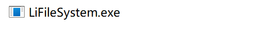

# 类Linux实现——简单文件系统

## 1. 简介

本项目是一个简单的文件系统，实现了以下功能：

1. 文件系统虚拟磁盘
    1. `new`创建虚拟磁盘，包括超级块、位示图、inode表、数据区 ✔️
    2. `format`格式化虚拟磁盘，设置超级块、位示图、inode表、数据区的初始值 ✔️
   3. `sfs`挂载虚拟磁盘，加载超级块、位示图、inode表、数据区 ✔️
    4. `exit`卸载/保存虚拟磁盘，保存超级块、位示图、inode表、数据区 ✔️
    5. 空闲块管理，通过位图分配和回收inode和数据块，数据块额外采用成组链接法链接 ✔️
    6. 磁盘索引，目前在数据结构上支持单/双/三级索引，但是暂时没有实现多级索引的具体操作 ✔️
   7. 从配置文件读取配置信息 待完成
2. 文件操作
    1. `create/touch`创建文件—— ✔️
        1. 暂时不支持递归创建目录
        2. 不支持文件名中包含空格
    2. `delete/rm`删除文件 ✔️
        1. 暂时不支持`-r`递归删除目录
   3. `cat`查看文件——支持按文件名、大小、偏移量查看文件内容 ️✔️
   4. `echo`写入文件——支持向文件写入指定内容（会清空磁盘） ✔️
   5. `open`打开文件——支持打开文件，返回文件描述符 ✔️
   6. `close`关闭文件——支持关闭文件描述符 ✔️
   7. `write`写入文件——支持向文件描述符对应的文件写入指定内容 ✔️
   8. `read`读取文件——支持从文件描述符对应的文件读取指定内容 ✔️
   9. `seek`移动文件指针——支持移动文件描述符对应的文件指针 ✔️
3. 目录操作
    1. `mkdir`创建目录——支持`-p`参数递归创建目录 ✔️
    2. `rmdir`删除目录 ✔️
        1. 暂时不支持`-p`递归删除目录
        2. 暂时不支持`--ignore-fail-on-non-empty`参数
    3. `ls`查看目录内容——支持-l参数查看文件详细信息 ✔️
    4. `cd`切换目录——支持相对路径和绝对路径 ✔️
   5. `pwd`显示当前目录路径——显示当前目录的绝对路径 ✔️
4. 权限与用户
    1. 完成了底层对于用户的权限控制，但是暂时没有实现用户的概念，所以所有文件都是root用户的 ✔️
    2. 暂时不支持权限管理与用户管理相关的命令
5. 其他
   1. `clear`清屏——清空终端屏幕 ✔️
   2. `quit`退出程序——保存文件系统状态并退出程序 ✔️
   3. `help`帮助命令——列出所有支持的命令 ✔️
   4. `exit`退出程序——保存文件系统状态并退出程序 ✔️
   5. 使用**LRU算法**缓存INode，减少磁盘IO次数 ✔️
   6. VI编辑器——支持简单的VI编辑器，支持`i`插入、`w`保存、`q`退出、`dd`删除行、`yy`复制行、`p`粘贴行 TODO

## 2. 项目结构

```
main.cpp // 主函数，产生交互界面
FileSystem.cpp // 文件系统类，提供文件系统的大部分操作
FSHelper.cpp // 文件系统帮助信息
VDisk.h // 虚拟磁盘类，提供虚拟磁盘的数据结构与常量定义
INodeCache.cpp // INode缓存类，提供INode的缓存机制
FileManager.cpp // 文件管理类，提供文件描述符的管理
```

## 2. 使用方法

### 可执行文件

本系统的可执行文件均存放在bin目录下。

#### Windows

双击可执行程序执行：



如果无法正常打开，可能是因为编译版本不匹配，可尝试自行在项目目录编译得到可执行文件。

#### Linux

终端输入以下命令执行：

```shell
./LiFileSystem
```

### 源码编译

本项目采用CMake+Ninja构建，编译源码需要安装CMake和Ninja。

在项目根目录下执行以下命令：

```shell
mkdir build
cd build
cmake -G Ninja ..
ninja
```

编译完成后，可执行文件在`build/src`目录下。

## 3. 使用流程

### 创建虚拟磁盘

使用以下命令创建虚拟磁盘：

```shell
new example
```

这会在本机当前目录下创建一个名为`example.vdisk`的虚拟磁盘。
并且系统会自动格式化和挂载这个虚拟磁盘。

而如果new命令后面没有跟虚拟磁盘文件名，则会尝试创建`LiFS.vdisk`虚拟磁盘。

### 载入虚拟磁盘

使用以下命令载入虚拟磁盘：

```shell
sfs example.vdisk
```

这会载入当前目录下的`example.vdisk`虚拟磁盘。

而如果sfs命令后面没有跟虚拟磁盘文件名，则会尝试载入当前目录下的`LiFS.vdisk`虚拟磁盘。

### 退出虚拟磁盘

使用以下命令退出虚拟磁盘：

```shell
exit
```

这会保存当前文件系统的状态，并退出虚拟磁盘。

### 退出程序

使用以下命令退出程序：

```shell
quit
```

这会保存当前文件系统的状态，并退出程序。

### clear清屏

使用以下命令清屏：

```shell
clear
```

**！！！在进入文件系统后，可以执行以下命令：**

### 格式化虚拟磁盘

使用以下命令格式化虚拟磁盘：

```shell
format
```

这会格式化当前虚拟磁盘，清空所有数据。

### 创建文件

使用以下命令创建文件：

```shell
create file1 
# or
touch file1
```

这个命令支持相对路径与绝对路径。

### 删除文件

使用以下命令删除文件：

```shell
delete file1
# or
rm file1
```

这个命令支持相对路径与绝对路径。

### 打开文件

使用以下命令打开文件：

```shell
open file1
```

这个命令会打开`file1`文件，并返回文件描述符。

### 关闭文件

使用以下命令关闭文件：

```shell
close fd
```

这个命令会关闭文件描述符`fd`对应的文件。

### 移动文件指针

使用以下命令移动文件指针：

```shell
seek fd 10
```

这个命令会移动文件描述符`fd`对应的文件指针到`10`处。

### 读取文件

使用以下命令读取文件：

```shell
read fd 10
```

该命令会从文件描述符`fd`对应的文件中读取`10`个字节。

### 写入文件

使用以下命令写入文件：

```shell
write fd "Hello World"
```

该命令会向文件描述符`fd`对应的文件写入`Hello World`。

### cat查看文件

使用以下命令查看文件：

```shell
cat file1 -n 10 -o 10
```

该命令会查看`file1`文件，显示前`10`个字节，偏移量为`10`。

该命令运行时会首先尝试以只读方式打开文件，如果文件不存在则会报错。
在打开文件后会设置文件指针的位置，然后读取文件内容。

### echo写入文件

使用以下命令写入文件：

```shell
echo hello > file1
```

该命令会向`file1`文件写入`hello`。

该命令会首先尝试以只写方式打开文件，如果文件不存在则会创建文件。
而只写模式会清空文件内容，然后写入新内容。

### 创建目录

使用以下命令创建目录：

```shell
mkdir dir1
```

这个命令支持相对路径与绝对路径，同时也支持递归创建目录：

```shell
mkdir -p dir1/dir2/dir3
```

### 查看目录

使用以下命令查看目录：

```shell
ls dir1
```

这个命令会列出`dir1`目录下的所有文件和目录。
当然，这个命令也支持`-l`参数，可以查看详细信息。

详细信息包括：文件类型、权限、所有者、组、大小、修改时间和文件名。

### 删除目录

使用以下命令删除目录：

```shell
rmdir dir1
```

这个命令会删除`dir1`目录，支持相对路径与绝对路径。目前这个命令不支持递归删除目录。

### 切换目录

使用以下命令切换目录：

```shell
cd dir1
```

这个命令会切换到`dir1`目录，支持相对路径与绝对路径，如果目录不存在会切换到当前用户的主目录。

### 查看系统信息

使用以下命令查看系统信息：

```shell
info
```

会打印当前文件系统的信息。

也可以采用`super`命令查看超级块信息：

```shell
super
```
