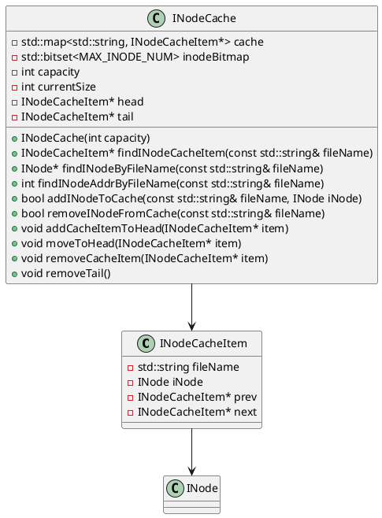
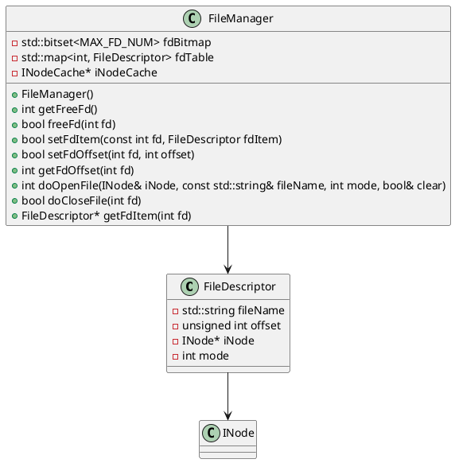
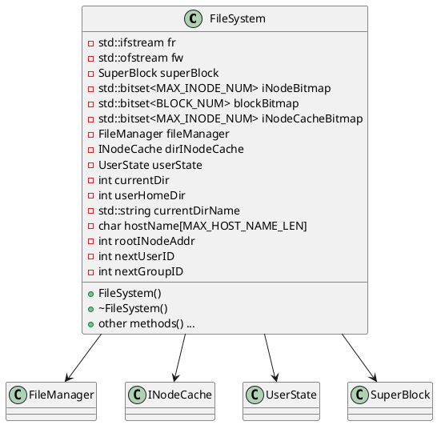
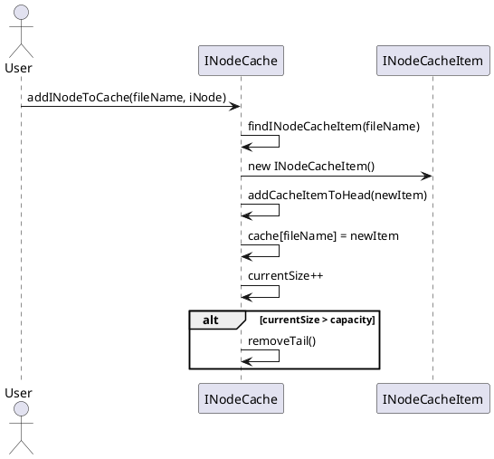

# 实验四——简单文件系统

[//]: # (目录)

[TOC]

## 1. 实验内容

通过对具体的文件存储空间的管理、文件的物理结构、目录结构和文件操作的实现，加深对文件系统内部功能和实现过程的理解。

## 2. 程序中使用的数据结构及符号说明

### 2.1 虚拟磁盘

#### 2.1.1 虚拟磁盘参数定义

在虚拟磁盘部分，使用宏定义定义了系统的一些参数：

```cpp
/*-------------------文件系统常量-------------------*/
// 版本号
#define VERSION "1.0"
// 作者
#define AUTHOR "Li Zhuo"
// 邮箱
#define EMAIL "Lz1958455046@outlook.com or 1120211231@bit.edu.cn"
// 数据块大小
#define BLOCK_SIZE 512
// inode节点大小
#define INODE_SIZE 128
// 数据块指针数目
#define BLOCK_POINTER_NUM 12
// 目录项名称最大长度
#define MAX_DIRITEM_NAME_LEN 28
// 虚拟磁盘大小，即3.2MB
#define MAX_DISK_SIZE (320*1000)
// BLOCK数目，暂定为1024
#define BLOCK_NUM 1024
// inode节点数目，暂定为512
#define MAX_INODE_NUM 512
// 每个块组的块数
#define BLOCK_GROUP_SIZE 32
#define FREE_BLOCK_STACK_SIZE 64
// inode缓存大小
#define MAX_INODE_CACHE_SIZE 128

/*-------------------文件系统目录项/INode常量-------------------*/

// 文件类型
#define FILE_TYPE 00000
// 目录类型
#define DIR_TYPE 01000
// 链接类型
#define LINK_TYPE 02000
// 本用户读权限
#define OWNER_R	4<<6
//本用户写权限
#define OWNER_W	2<<6
// 本用户执行权限
#define OWNER_X	1<<6
// 组用户读权限
#define GROUP_R	4<<3
// 组用户写权限
#define GROUP_W	2<<3
// 组用户执行权限
#define GROUP_X	1<<3
// 其他用户读权限
#define OTHERS_R	4
// 其他用户写权限
#define OTHERS_W	2
// 其他用户执行权限
#define OTHERS_X	1
// 默认权限：文件，即本用户和组用户有读写权限，其他用户有读权限
#define DEFAULT_FILE_MODE 0777
// 默认权限：目录，即本用户有读写执行权限，其他用户和组用户有读和执行权限
#define DEFAULT_DIR_MODE 0777

/*-------------------文件系统用户常量-------------------*/
/* 用户 */
// 用户名最大长度
#define MAX_USER_NAME_LEN 20
// 用户组名最大长度
#define MAX_GROUP_NAME_LEN 20
// 用户密码最大长度
#define MAX_PASSWORD_LEN 20
// 用户状态
#define MAX_USER_STATE 1
// 主机名最大长度
#define MAX_HOST_NAME_LEN 32
```

在以上的宏定义中，分为文件系统常量、文件系统目录项/INode常量和文件系统用户常量三部分。
在**文件系统部分**
，主要的宏定义是对文件系统的一些参数进行定义，如数据块大小、inode节点大小、数据块指针数目、目录项名称最大长度、虚拟磁盘大小、BLOCK数目、inode节点数目、每个块组的块数、FREE_BLOCK_STACK_SIZE、inode缓存大小等。
而在文件系统**目录项/INode常量**
部分，主要是对文件类型、目录类型、链接类型、权限等进行定义。类型与权限采用了八进制的形式进行定义，如文件类型为00000，目录类型为01000，链接类型为02000，本用户读权限为4<<
6，本用户写权限为2<<6，本用户执行权限为1<<6，组用户读权限为4<<3，组用户写权限为2<<3，组用户执行权限为1<<
3，其他用户读权限为4，其他用户写权限为2，其他用户执行权限为1，文件的默认权限为0777，目录的默认权限为0777。
在文件系统**用户常量**部分，主要是对用户、用户组、用户密码、用户状态、主机名等进行定义，如用户名最大长度为20，用户组名最大长度为20，用户密码最大长度为20，用户状态最大长度为1，主机名最大长度为32。

除此之外，也采用全局变量的形式定义了一些参数：

```cpp
/* 全局变量 */
// 超级块开始位置,占一个磁盘块
const int superBlockStartPos = 0;
// inode位图开始位置,位图占两个磁盘块
const int iNodeBitmapStartPos = 1 * BLOCK_SIZE;
// 数据块位图开始位置，数据块位图占20个磁盘块
const int blockBitmapStartPos = iNodeBitmapStartPos + 2 * BLOCK_SIZE;
// inode节点开始位置,占 INODE_NUM/(BLOCK_SIZE/INODE_SIZE) 个磁盘块即 129 个磁盘块
const int iNodeStartPos = blockBitmapStartPos + 20 * BLOCK_SIZE;
// 数据块开始位置，占 BLOCK_NUM 个磁盘块
const int blockStartPos = iNodeStartPos + (MAX_INODE_NUM * INODE_SIZE) / BLOCK_SIZE + 1;
// 虚拟磁盘文件大小
const int diskBlockSize = blockStartPos + BLOCK_NUM * BLOCK_SIZE;
// 单个虚拟磁盘文件文件最大大小
const int maxFileSize = 9 * BLOCK_SIZE + BLOCK_SIZE / sizeof(int) * BLOCK_SIZE + BLOCK_SIZE / sizeof(int) * BLOCK_SIZE *
    BLOCK_SIZE / sizeof(int);
// 虚拟磁盘缓冲区，初始为最大缓冲区大小
static char diskBuffer[MAX_DISK_SIZE];
```

在以上的全局变量中，定义了超级块开始位置、inode位图开始位置、数据块位图开始位置、inode节点开始位置、数据块开始位置、虚拟磁盘文件大小、单个虚拟磁盘文件最大大小、虚拟磁盘缓冲区等参数。

#### 2.1.2 虚拟磁盘数据结构

在虚拟磁盘数据结构部分，定义了虚拟磁盘的数据结构：

##### 超级块

```cpp
struct SuperBlock
{
    /* 节点数目 */
    // inode节点数目，最多65535个
    unsigned short iNodeNum;
    // 数据块数目，最多4294967295个
    unsigned int blockNum;
    // 空闲inode节点数目
    unsigned short freeINodeNum;
    // 空闲数据块数目
    unsigned int freeBlockNum;

    /* 空闲块堆栈 */

    // 空闲块堆栈
    int freeBlockStack[BLOCK_GROUP_SIZE];
    // 堆栈顶指针
    int freeBlockAddr;

    /* 大小 */

    // 磁盘块大小
    unsigned short blockSize;
    // inode节点大小
    unsigned short iNodeSize;
    // 超级块大小
    unsigned short superBlockSize;
    // 每个块组的块数
    unsigned short blockGroupSize;

    /* 磁盘分布（各个区块在虚拟磁盘中的位置） */

    // 超级块位置
    int superBlockPos;
    // inode位图位置
    int iNodeBitmapPos;
    // 数据块位图位置
    int blockBitmapPos;
    // inode节点起始位置
    int iNodeStartPos;
    // 数据块起始位置
    int blockStartPos;
};
```

超级块将被存储在虚拟磁盘的第一个磁盘块中，用于记录文件系统的基本信息，如inode节点数目、数据块数目、空闲inode节点数目、空闲数据块数目、空闲块堆栈、大小、磁盘分布等参数。
而在载入时，超级块将被载入到内存中，用于文件系统的操作。

##### inode节点

```cpp
struct INode
{
    // inode节点号
    unsigned short iNodeNo;
    // 文件类型与存取权限 采用八进制表示 例如：0755表示文件类型为普通文件，所有者有读写执行权限，组用户和其他用户有读和执行权限
    unsigned short iNodeMode;
    // 链接数
    unsigned short iNodeLink;
    // 文件所有者，字符串
    char iNodeOwner[MAX_USER_NAME_LEN];
    // 文件所属组，字符串
    char iNodeGroup[MAX_GROUP_NAME_LEN];
    // 文件大小
    unsigned int iNodeSize;
    // 文件创建时间，时间戳
    time_t iNodeCreateTime;
    // 文件修改时间，时间戳
    time_t iNodeModifyTime;
    // 文件访问时间，时间戳
    time_t iNodeAccessTime;
    // 文件数据块指针, 9个直接指针，1个一级间接指针，1个二级间接指针，1个三级间接指针
    int iNodeBlockPointer[BLOCK_POINTER_NUM];
};
```

为了保持128字节的大小，inode节点中的文件名、文件类型、文件权限、文件大小、文件创建时间、文件修改时间、文件访问时间、文件数据块指针等参数都被定义为了固定大小的数据类型，如文件名为28字节的字符串、文件类型为2字节的无符号短整型、文件权限为2字节的无符号短整型、文件大小为4字节的无符号整型、文件创建时间、文件修改时间、文件访问时间为8字节的时间戳、文件数据块指针为48字节的整型数组。

##### 目录项

```cpp
struct DirItem
{
    // 目录项名
    char itemName[MAX_DIRITEM_NAME_LEN];
    // inode地址
    int iNodeAddr;
};
```

目录项的大小为32字节，其中包括了目录项名和inode地址。在一个磁盘块中，可以存储16个目录项。

##### 空闲目录项索引

```cpp
struct FreeDirItemIndex
{
    // 目录项索引
    int dirItemIndex;
    // 目录项内的索引
    int dirItemInnerIndex;
};
```

该数据结构用于记录空闲目录项的索引，包括目录项索引和目录项内的索引。

### 2.2 INode缓存

```cpp
struct INodeCacheItem
{
    // file name， key
    std::string fileName;
    // inode节点， value
    INode iNode;
    // 前一个节点
    INodeCacheItem* prev;
    // 后一个节点
    INodeCacheItem* next;
};
```

INode缓存采用了LRU算法，用于缓存inode节点，减少对磁盘的访问次数。在本系统中采用了双向链表的形式进行存储。

```cpp
class INodeCache
{
public:
    // INode缓存，使用哈希表存储
    std::map<std::string, INodeCacheItem*> cache;
    // 文件描述符的位图，用于查找空闲的文件描述符
    std::bitset<MAX_INODE_NUM> inodeBitmap;

    // 缓存大小
    int capacity;
    // 当前缓存大小
    int currentSize;

    // 头指针
    INodeCacheItem* head;
    // 尾指针
    INodeCacheItem* tail;

    explicit INodeCache(int capacity);
    INodeCacheItem* findINodeCacheItem(const std::string& fileName);
    INode* findINodeByFileName(const std::string& fileName);
    int findINodeAddrByFileName(const std::string& fileName);
    bool addINodeToCache(const std::string& fileName, INode iNode);
    bool removeINodeFromCache(const std::string& fileName);
    void addCacheItemToHead(INodeCacheItem* item);
    void moveToHead(INodeCacheItem* item);
    void removeCacheItem(INodeCacheItem* item);
    void removeTail();
};
```

以上是INode缓存的数据结构，其中包括了INode缓存、文件描述符的位图、缓存大小、当前缓存大小、头指针、尾指针等参数。在INodeCache类中，定义了一些方法，如通过文件名查找INode节点、添加INode节点到缓存、从缓存中删除INode节点等。

而以上类的类图如下:



### 2.3 文件描述符管理

定义了如下的常量与数据结构：

```cpp
/*-------------------文件描述符-------------------*/
// 最大文件描述符数目
#define MAX_FD_NUM 128
// 文件打开模式，采用二进制描述，在模式控制时使用位运算
#define MODE_R 0b001
#define MODE_W 0b010
// 是否为追加模式
#define MODE_A 0b100
// 默认文件打开模式
#define MODE_DEFAULT MODE_R

/**
 * 文件描述句柄
 * 当前文件偏移量（调用read()和write()时更新，或使用lseek()直接修改）
 * 对应的INode引用
 * 文件打开模式 r/w/rw
 */
struct FileDescriptor
{
    // 文件名
    std::string fileName;
    // 当前文件偏移量
    unsigned int offset;
    // INode引用
    INode* iNode;
    // 文件打开模式
    int mode;
};

/**
 * 文件管理类
 * 用于管理文件系统中的文件文件描述符和文件缓存的对应关系
 */
class FileManager
{
public:
    // 文件描述符的位图，用于查找空闲的文件描述符
    std::bitset<MAX_FD_NUM> fdBitmap;
    // 文件描述符表，用于查找文件描述符对应的文件句柄
    std::map<int, FileDescriptor> fdTable;
    // 文件缓存，用于缓存文件内容
    INodeCache* iNodeCache;
    FileManager();
    int getFreeFd();
    bool freeFd(int fd);
    bool setFdItem(const int fd, FileDescriptor fdItem);
    bool setFdOffset(int fd, int offset);
    int getFdOffset(int fd);
    int doOpenFile(INode& iNode, const std::string& fileName, int mode, bool& clear);
    bool doCloseFile(int fd);
    FileDescriptor* getFdItem(int fd);
};
```

在文件描述符管理部分，定义了最大文件描述符数目、文件打开模式、是否为追加模式、默认文件打开模式等常量。在数据结构部分，定义了文件描述句柄和文件管理类。文件描述句柄包括了文件名、当前文件偏移量、INode引用、文件打开模式等参数。文件管理类包括了文件描述符的位图、文件描述符表、文件缓存等参数。在文件管理类中，定义了一些方法，如获取空闲文件描述符、释放文件描述符、设置文件描述符、设置文件偏移量、获取文件偏移量、打开文件、关闭文件、获取文件描述符等。

以上的类的类图如下：



### 2.4 文件系统帮助类

仅为一个静态类，用于提供一些文件系统操作的帮助函数。

```cpp
/**
* 帮助文档类
* @brief 显示帮助文档
*/
class Helper {
public:
    /**
    * 显示帮助文档
    */
    static void showHelpInformation(const std::string& command);
private:
    // new命令帮助信息
    static void showNewHelp();
    // sys命令帮助信息
    static void showSysHelp();
    // cd命令帮助信息
    static void showCdHelp();
    // ls命令帮助信息
    static void showLsHelp();
    // ...
};
```

以上的类中，具体的方法帮助暂未实现，仅为一个静态类。但实现了总的帮助文档的显示。

### 2.5 文件系统类

文件系统类是整个文件系统的核心类，用于实现文件系统的基本操作。

首先定义了一个`UserState`结构体，用于表示用户的状态：

```cpp
/**
 * 用户状态
 */
struct UserState
{
    // 是否已经登录
    bool isLogin;
    // 用户名
    char userName[MAX_USER_NAME_LEN];
    // 用户所在组
    char userGroup[MAX_GROUP_NAME_LEN];
    // 用户密码
    char userPassword[MAX_PASSWORD_LEN];
    // 用户ID
    unsigned short userID;
    // 用户组ID
    unsigned short userGroupID;
};
```

然后定义了文件系统类：

```cpp
class FileSystem {
public:
    // 构造函数
    FileSystem();
    // 析构函数
    ~FileSystem();
    void printBuffer();
    void readSuperBlock();
    bool installed;

    /*-------------------文件系统基本操作-------------------*/

    void getHostName();
    int allocateINode();
    bool freeINode(int iNodeAddr);
    int allocateBlock();
    bool freeBlock(int blockAddr);
    bool formatFileSystem();
    void initSystemConfig();
    void createFileSystem(const std::string& systemName);
    bool installFileSystem();
    void uninstall();
    void load(const std::string &filename);
    void save();
    void executeInFS(const std::string &command);
    void printSuperBlock();
    void printSystemInfo();
    void printUserAndHostName();
    void clearScreen();
    std::string getAbsolutePath(const std::string& dirName, const std::string& INodeName);
    INode* findINodeInDir(INode& dirINode, const std::string& dirName, const std::string& INodeName, int type);
    FreeDirItemIndex findFreeDirItem(const INode& dirINode, const std::string& itemName, int itemType);
    FreeDirItemIndex findFreeDirItem(const INode& dirINode);
    void clearINodeBlocks(INode& iNode);
    int calculatePermission(const INode& iNode);
    INode* findINodeInCache(const std::string& absolutePath, int type);

    /*-------------------文件系统文件操作-------------------*/

    int openFile(std::string& dirName, int dirAddr, std::string& fileName, int mode);
    void openWithFilename(const std::string& arg);
    bool closeWithFd(int fd);
    void closeFile(const std::string& arg);
    void seekWithFd(const std::string& arg);
    bool createFileHelper(const std::string& fileName, int dirINodeAddr, char* content, unsigned int size);
    void createFile(const std::string& arg);
    bool sysReadFile(INode& iNode, unsigned int offset, unsigned int size, char* content);
    bool readWithFd(int fd, char* content, unsigned int size);
    void readFile(const std::string& arg);
    void catFile(const std::string& arg);
    bool sysWriteFile(INode& iNode, const char* content, unsigned int size, unsigned int offset);
    bool writeWithFd(int fd, const char* content, unsigned int size);
    void writeFile(const std::string& arg);
    void deleteFile(const std::string& arg);
    void echoFile(const std::string& arg);

    /*-------------------文件系统目录操作-------------------*/

    void makeDir(const std::string& arg);
    bool mkdirHelper(bool pFlag, const std::string& dirName, int inodeAddr);
    bool rmdirHelper(bool ignore, bool pFlag, const std::string& dirName, int inodeAddr);
    void removeDir(const std::string& arg);
    void listDir(const std::string& arg);
    void listDirByINode(int inodeAddr, int lsMode);
    bool changeDir(const std::string& arg, int& currentDir, std::string& currentDirName);
    void printCurrentDir();

    /*-------------------文件系统用户操作-------------------*/

    void login(const std::string &userName, const std::string &password);
    void logout();
    void createUser(const std::string &userName, const std::string &password);
    void deleteUser(const std::string &userName);
    void changePassword(const std::string &userName, const std::string &password);
    void listUser();
    void listGroup();

    /*-------------------文件系统权限操作-------------------*/

    void changeMode(const std::string &filename, const std::string &mode);
    void changeOwner(const std::string &filename, const std::string &owner);
    void changeGroup(const std::string &filename, const std::string &group);

    /*-------------------文件系统其他操作-------------------*/

    void viEditor(char* str, int inodeAddr, unsigned int size);
    void vi(const std::string& arg);

private:
    /*-------------------系统-------------------*/
    // 读系统文件的指针
    std::ifstream fr;
    // 写系统文件的指针
    std::ofstream fw;
    // 超级块
    SuperBlock superBlock{};
    // inode位图
    std::bitset<MAX_INODE_NUM> iNodeBitmap;
    // 数据块位图
    std::bitset<BLOCK_NUM> blockBitmap;
    // 判断inode缓存是否与磁盘同步的位图
    std::bitset<MAX_INODE_NUM> iNodeCacheBitmap;
    // FileManager类
    FileManager fileManager;
    // // 文件inode缓存
    // INodeCache fileINodeCache;
    // 目录inode缓存
    INodeCache dirINodeCache;

    /*-------------------用户-------------------*/
    // 用户状态
    UserState userState{};
    // 当前目录
    int currentDir{};
    // 当前用户主目录
    int userHomeDir;
    // 当前目录名
    std::string currentDirName;
    // 当前主机名
    char hostName[MAX_HOST_NAME_LEN]{};
    // 根目录inode节点
    int rootINodeAddr{};
    // 下一个要被分配的用户标识
    int nextUserID;
    // 下一个要被分配的组标识
    int nextGroupID;

};
```

在文件系统类中，定义了一些基本的文件系统操作、文件操作、目录操作、用户操作、权限操作、其他操作等方法。在文件系统类中，定义了一些私有的参数，如读系统文件的指针、写系统文件的指针、超级块、inode位图、数据块位图、判断inode缓存是否与磁盘同步的位图、FileManager类、目录inode缓存、用户状态、当前目录、当前用户主目录、当前目录名、当前主机名、根目录inode节点、下一个要被分配的用户标识、下一个要被分配的组标识等参数。

以上类的类图如下：



## 3. 模块设计与处理流程

### 3.1 INode缓存

在缓存模块中，采用了LRU算法，用于缓存inode节点，减少对磁盘的访问次数。在本系统中采用了双向链表的形式进行存储。

[//]: # (使用plantuml绘制用例图)



以上是INode缓存添加INode节点的序列图。

而对于查找INode节点，采用了哈希表的形式进行存储，通过文件名查找INode节点。
另外，在删除节点时，则是查找到节点后，将节点从链表中删除，并释放内存。

### 3.2 文件描述符管理

在文件描述符管理模块，主要涉及到文件描述符的分配、释放、设置、打开、关闭、读写等操作。重点在于文件描述符的分配与文件打开操作。

在分配时，会去位图中查找最小的空闲文件描述符，然后将其分配给用户。

而在打开文件时，会首先申请一个文件描述符，然后新建一个文件描述句柄，将文件描述符与文件描述句柄进行绑定，根据权限设置句柄的偏移量、mode等属性，最后将文件描述句柄存入文件描述符表中。

### 3.3 文件系统模块

#### 3.3.1 文件系统新建与载入
